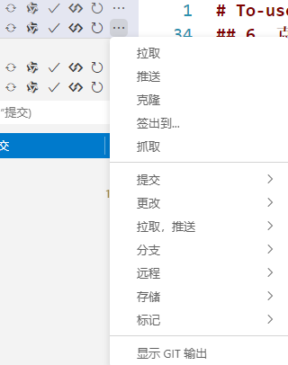

# To-use-the-built-in-source-code-management-in-Visual-Studio-Code

## 怎么在Vscode使用其自带的源代码管理（教程）

## 使用 VSCode 配置 Git 连接 GitHub 具体步骤

## 1. 安装 Git

确保你已经在本地安装了 Git。如果没有安装，可以从 [Git 官网](https://git-scm.com/) 下载并安装。

## 2. 创建 GitHub 账户

如果你还没有 GitHub 账户，需要先在 [GitHub 官网](https://github.com/) 注册一个账户。

## 3. 配置 Git

打开终端，输入以下命令配置你的 Git 用户名和邮箱：
`git config --global user.name "你的用户名"`
`git config --global user.email "你的邮箱"`

## 4. 生成 SSH 密钥

如果你还没有生成 SSH 密钥，可以使用以下命令生成：
`ssh-keygen -t rsa -b 4096 -C "你的邮箱"`
按提示操作，通常可以直接按回车键使用默认设置。生成的密钥会保存在 `~/.ssh` 目录下。

## 5. 添加 SSH 密钥到 GitHub

使用 `cat ~/.ssh/id_ed25519.pub` 命令，复制其中的内容。然后登录 GitHub，进入 `Settings` -> `SSH and GPG keys`，点击 `New SSH key`，将复制的内容粘贴到 Key 文本框中，点击 `Add SSH key`。

## 6. 克隆仓库

在 GitHub 上创建一个新的仓库，或者选择一个已有的仓库。点击仓库页面上的 `Code` 按钮，复制 SSH URL（例如：`git@github.com:username/repository.git`）。

在之后弹出的输入框输入你的`SSH URL`或者`HTTPS URL`

## 7.或者直接进行登录克隆

你也可以直接在 VSCode 中克隆仓库。只是要Github登录

之后直接点击从Github克隆，选择你要克隆的仓库，然后点击克隆即可。

## 8. 使用 VSCode 进行版本控制

在 VSCode 中，你可以使用左侧的源代码管理视图（Source Control View）进行文件的添加、提交、推送等操作。

- **添加文件**：点击 `+` 按钮将文件添加到暂存区。
- **提交更改**：在消息框中输入提交信息，然后按 `Ctrl + Enter` 提交更改。
- **推送更改**：点击 `...` 按钮，选择 `Push` 将更改推送到 GitHub。

通过以上步骤，你就可以在 VSCode 中使用 Git 连接并管理 GitHub 仓库了。
